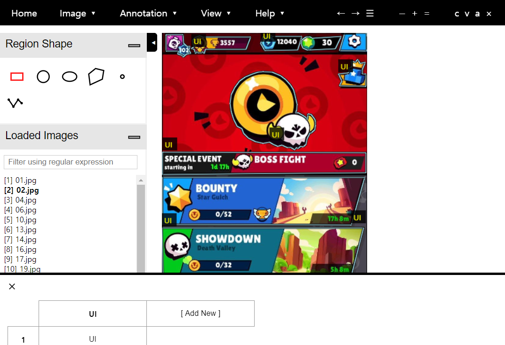
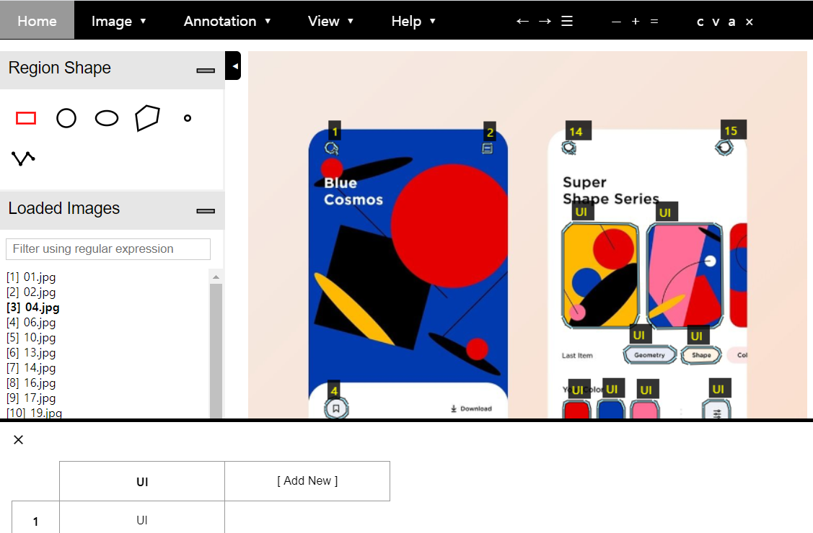
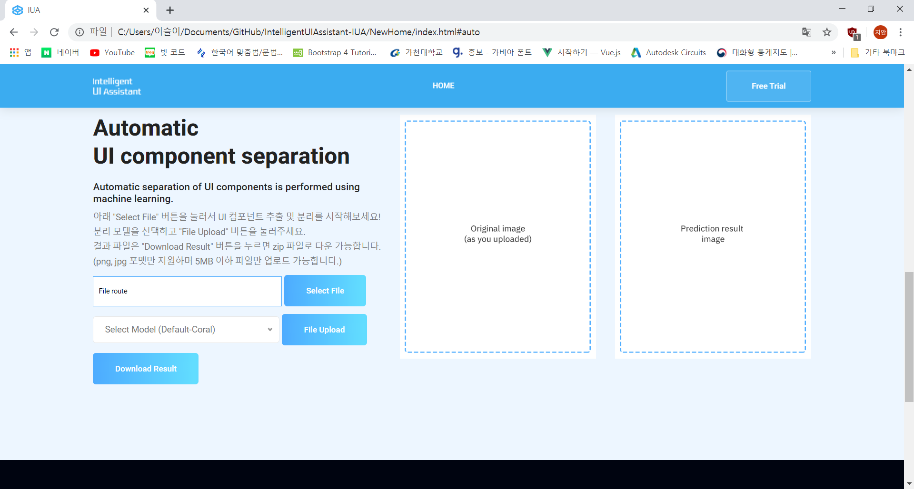
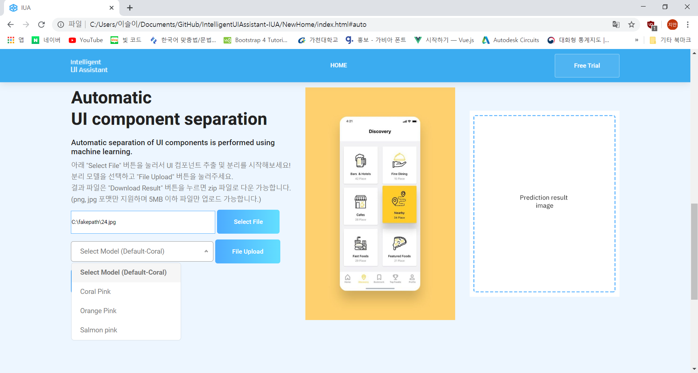
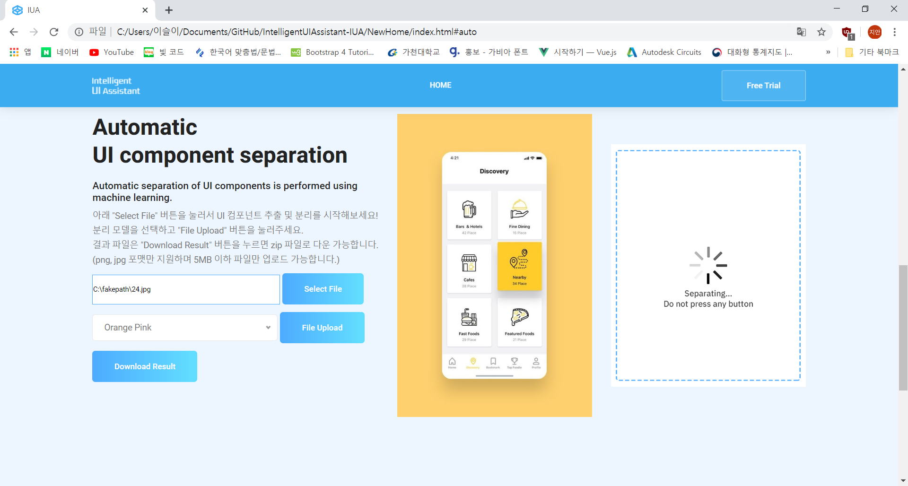
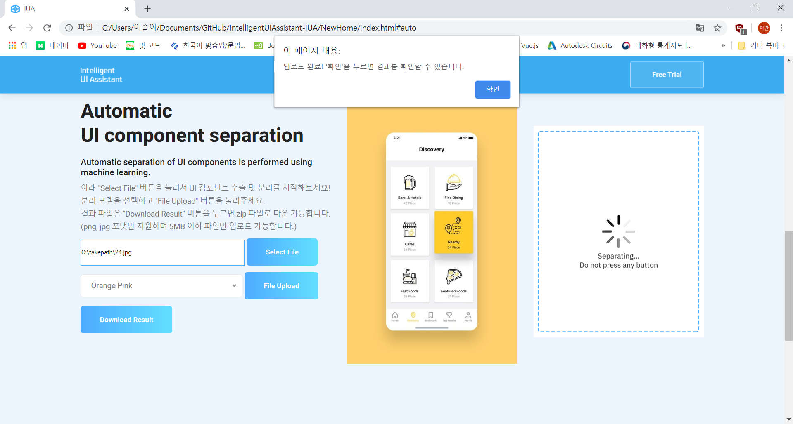
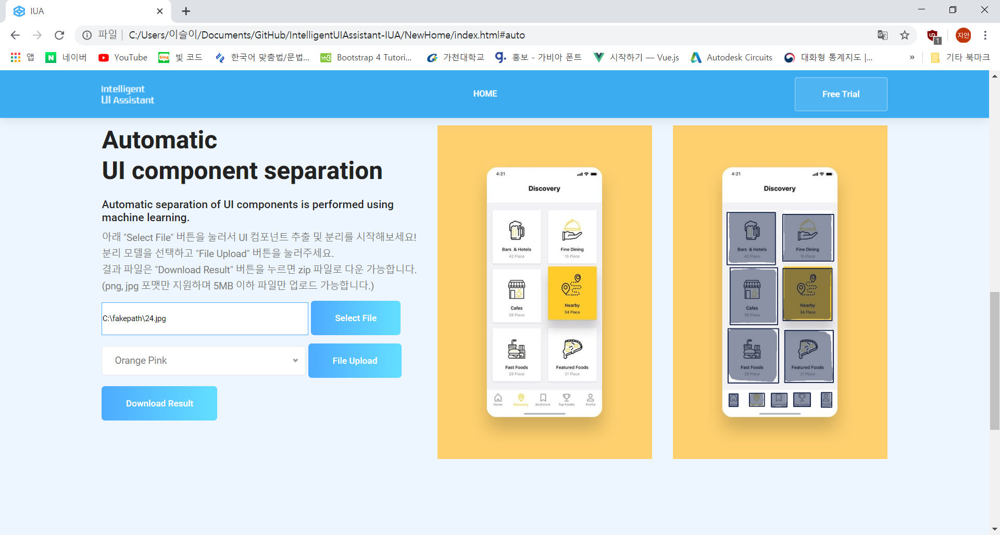
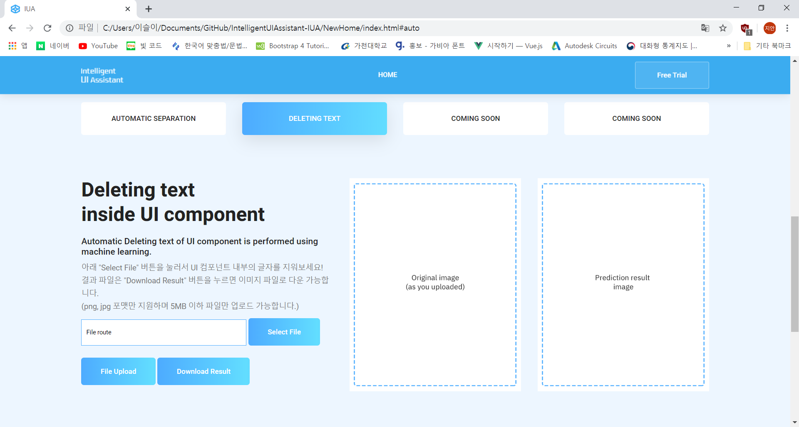
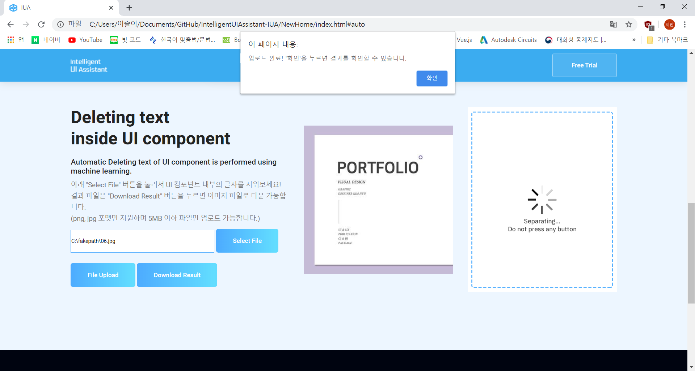
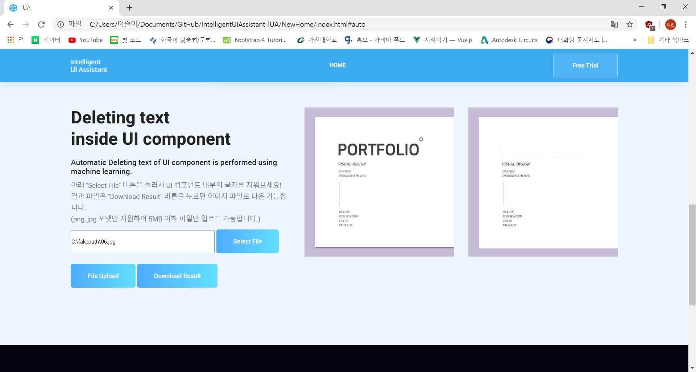

# IntelligentUIAssistant-IUA
IUA is a web application that mainly performs the task of separating the UI of graphic components. 

### The server environment for execution is: 
> * Python 3.6 
> * tensorflow-gpu 1.15.0 
> * keras 2.2.5 
> * openCV 4.1.0 
> * tesseract-orc v5.0.0 
> * firebase_admin 4.3.0 
> * Python google.cloud 
> * Python websockets 
> * Python zipfile37 
### Used library: 
> * numpy 
> * scipy 
> * Pillow 
> * cython 
> * matplotlib 
> * pytesseract 
> * scikit-image 
> * tensorflow>=1.3.0 
> * keras>=2.0.8 
> * opencv-python 
> * h5py 
> * imgaug 
> * IPython[all] 
## UI Component Separation
The UI components of the image entered by the user are automatically separated using the learned model. 
### UI Detection 
To detect UI, we used Mask R-CNN among object detection models. 
#### Mask R-CNN
This project utilized the code here. [Mask-RCNN](https://github.com/matterport/Mask_RCNN)

- Train Model-train.ipynb
 1. Prepare the custom dataset.
     - After labeling each image, save it to a dataset file.(train/val)
     - Use this link to proceed with labeling.[Labeling](http://www.robots.ox.ac.uk/~vgg/software/via/via-1.0.6.html)
 
   
 
 2. Download mask_rcnn_coco.h5 file.[Link](https://github.com/matterport/Mask_RCNN/releases)
 
 3. Install tensorflow-gpu = 1.15.0 and keras=2.2.5.
   > pip install tensorflow-gpu==1.15.0 
   > pip install keras==2.2.5 
 
 4. Train Custom Dataset
   > python ui.py train --dataset='path of dataset' --weights=coco  
  
- Validate Model-validation.ipynb
Visualize the detection result. We chose the three most accurate models.

### Example Code - /edit_ui/seperate_ui.py
~~~
def main(TRAINED_MASKRCNN_WEIGHTS_, user_image_):
    global colors, class_dict
    load_weights()
    colors = random_colors(len(class_names))
    class_dict = {name: color for name, color in zip(class_names, colors)}

    global TRAINED_MASKRCNN_WEIGHTS
    TRAINED_MASKRCNN_WEIGHTS = TRAINED_MASKRCNN_WEIGHTS_
    global user_image
    user_image = user_image_
    print("model name(seperate_ui): ", TRAINED_MASKRCNN_WEIGHTS)
    print("image name(seperate_ui)", user_image)

~~~
> TRAINED_MASKRCNN_WEIGHTS_: Take over the trained model you want to use. 
> user_image_: Take over the image name that you want to separate UI. 

Set parameters and run seperate_ui.py

### Execution Screen

1. Upload the image you want to separate the UI components. And choose one of the pre-learned models.

2. The detection result can be checked after loading time. 

3. Press the download button to receive the results in the zip file format.
## Deleteing Text Inside UI Component

From the user-entered UI component, it recognizes text part using OCR and removes the text. 

### Tesseract-ORC
Tesseract is an open source OCR engine.[Tesseract OCR](https://github.com/tesseract-ocr/tesseract) 
We used 'Tesseract at UB Mannheim' for the Windows version of Tesseract.

1. Install the installer for your computer operating system.[Tesseract at UB Mannheim](https://github.com/UB-Mannheim/tesseract/wiki)

2. Check the desired language in the 'Additional language data (download)' and proceed with the download.

3. Install pytesseract
>  pip install pytesseract 

4. Edit pytesseract.py
> tesseract_cmd = 'tesseract' 

Edit it to the actual tesseract path you set up earlier.
 
5. Import phytesserct and use it.

### Example Code - Find text area
~~~
origin = cv2.imread(PATH_IMAGE)
origin = cv2.resize(origin, None, fx=2.5, fy=2.5)

image = cv2.cvtColor(origin, cv2.COLOR_BGR2GRAY)
_, image = cv2.threshold(image, 100, 255, cv2.THRESH_BINARY)

d = pytesseract.image_to_data(image, output_type=Output.DICT)

n_boxes = len(d['text'])
for i in range(n_boxes):
    if int(d['conf'][i]) > 60:
        (x, y, w, h) = (d['left'][i], d['top'][i], d['width'][i], d['height'][i])
        image = cv2.rectangle(origin, (x , y ), (x + w , y + h ), (255,0,0), 2)

cv2.imshow('img', origin)
cv2.waitKey(0)
~~~
> PATH_IMAGE: Image path to find text area. 

Set parameters and run then you can see the text area.
    
    
### Execution Screen

1. If you enter ui component, you can see that the letters disappeared from  after loading. 

2. Press the download button to receive the results in the zip file format.
